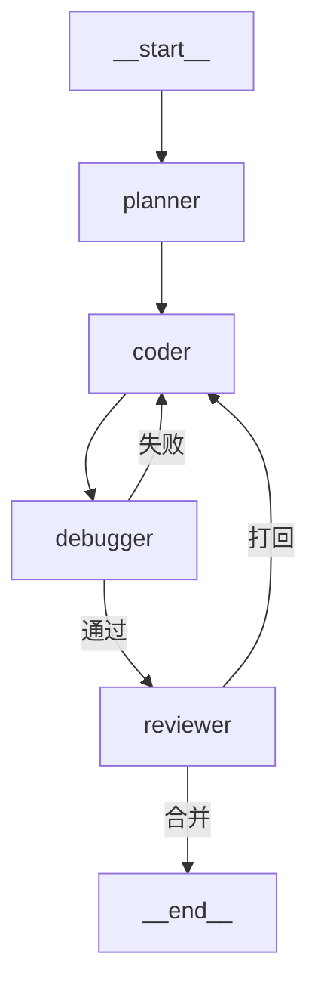

# P0 开发计划

> 基于 `docs/agent-flow-analysis-report.md` 第 5 节，P0 聚焦**可靠性**：让工作流在中断/恢复场景下不丢数据、不重复执行昂贵副作用。

---

## P0 任务总览

| 编号 | 事项 | 权重 | 目标 | 预计工作量 |
|------|------|------|------|------------|
| P0-1 | Activity / LLM 调用缓存 | 25 | 中断恢复不重复调用 LLM | 1-2 天 |
| P0-2 | 工具调用持久化 | 10 | 所有副作用可追踪、可审计 | 0.5 天 |
| P0-3 | 图校验增强 | 10 | 非法拓扑编译前报错 + Mermaid 导出 | 0.5-1 天 |

**依赖关系：**
- P0-1 是基础，P0-2 在其上叠加追踪层
- P0-3 完全独立，可与 P0-1/P0-2 并行

---

## P0-1: Activity / LLM 调用缓存（权重 25）

### 问题

当前 `nodes.py` 中每个节点直接调用 `get_registry().complete(...)`，然后才执行 `ctx.interrupt(...)`。如果图在 interrupt 处暂停后恢复，节点会从头重新执行，LLM 调用也会重跑。这浪费 token 且可能导致非幂等结果。

### 方案

引入 `ctx.activity(key, fn)` API：以 `(thread_id, node, key)` 为缓存键，首次执行 `fn()` 并缓存结果到 SQLite，后续重入直接返回缓存值。

```
节点执行流程：
  ctx.activity("llm_complete", lambda: get_registry().complete(...))
              │
              ├─ 首次：执行 fn() → 写入 activity_results 表 → 返回结果
              │
              └─ 恢复/重入：从 activity_results 表读取 → 直接返回缓存
```

### 改动文件

| 文件 | 改动 | 说明 |
|------|------|------|
| `agentflow/checkpoint.py` | 新增 `activity_results` 表 + `put_activity()` / `get_activity()` | SQLite 持久化缓存 |
| `agentflow/graph.py` | `NodeContext` 新增 `activity(key, fn)` 方法 | 节点内统一的缓存入口 |
| `agentflow/nodes.py` | planner/coder/debugger/reviewer 的 LLM 调用包上 `ctx.activity()` | 避免中断恢复重复调用 |
| `test/test_activity.py` | 新增测试 | 验证中断恢复不重复执行 fn |

### 关键设计

- **缓存键**：`(thread_id, node_name, activity_key)` — 同一节点多次调用不同 activity 不会冲突
- **缓存粒度**：每次 LLM 调用一个 activity。节点内多次 LLM 调用用不同 key 区分
- **与 interrupt 的交互**：activity 在 interrupt 之前执行，恢复时命中缓存，节点继续到 interrupt 点
- **不做 TTL**：activity 缓存与 thread 生命周期一致，不做过期清理

### 测试用例

1. 节点执行 `ctx.activity("a", fn)` → fn 被调用 1 次 → 返回结果
2. 中断恢复后同一节点再次执行 `ctx.activity("a", fn)` → fn **不再被调用** → 返回缓存结果
3. 不同 key 的 activity 各自独立缓存
4. 不同 thread 的缓存互不干扰

---

## P0-2: 工具调用持久化（权重 10）

### 问题

当前事件日志 `events` 表只记录 `node_ok` / `node_retry` / `interrupt` 等引擎级事件，没有对节点内部具体操作（LLM 调用、文件读写等）做结构化记录。调试和审计时需要知道每个节点做了什么、耗时多少、结果如何。

### 方案

在 `Checkpointer` 中新增 `tool_calls` 表，记录每次 activity 执行的详细信息。`ctx.activity()` 内部自动写入。

### 改动文件

| 文件 | 改动 | 说明 |
|------|------|------|
| `agentflow/checkpoint.py` | 新增 `tool_calls` 表 + `log_tool_call()` + `tool_calls(thread_id)` + `tool_call_summary(thread_id)` | 工具调用事件存储与查询 |
| `agentflow/graph.py` | `ctx.activity()` 内部自动调用 `log_tool_call()` | 对节点透明 |
| `test/test_activity.py` | 扩展测试覆盖工具调用记录 | 验证记录写入与查询 |

### 关键设计

- **tool_calls 表结构**：`(thread_id, seq, node, step, tool_name, activity_key, input_summary, output_summary, duration_ms, status, ts)`
- **自动记录**：`ctx.activity()` 内部自动记录，节点无需额外操作
- **查询 API**：
  - `checkpointer.tool_calls(thread_id)` → 该 thread 所有工具调用记录
  - `checkpointer.tool_call_summary(thread_id)` → 按 node 聚合的统计（调用次数、总耗时、成功/失败数）

---

## P0-3: 图校验增强（权重 10）

### 问题

当前 `compile()` 只做了最基础的校验（引用节点存在、有入口），以下问题要到运行时才发现：
- 不可达节点（从 START 出发永远走不到）
- 死胡同节点（没有路径能到 END）
- 条件边可能返回不存在的节点
- 没有可视化手段帮助调试图拓扑

### 方案

在 `StateGraph` 上新增 `validate()` 方法，编译前做静态拓扑分析，并支持 Mermaid 导出。

### 改动文件

| 文件 | 改动 | 说明 |
|------|------|------|
| `agentflow/graph.py` | `StateGraph` 新增 `validate()` + `to_mermaid()` | 拓扑校验 + 可视化导出 |
| `test/test_graph.py` | 新增测试 | 覆盖各种非法拓扑场景 |

### validate() 检查项

| 检查项 | 级别 | 说明 |
|--------|------|------|
| 所有节点可从 START 到达 | error | BFS 从 entry 出发，标记可达节点 |
| 所有节点可到达 END | warning | 反向 BFS，允许有意设计的终端节点 |
| 重复边 | warning | 同一 src→dst 出现多次 |
| 条件边函数可调用 | error | 检查 `callable()` |
| 条件边返回合法节点 | warning | 静态分析可能返回值（字符串字面量） |
| 存在循环 | info | DFS 检测，不阻止编译（循环是合法功能） |

### to_mermaid() 输出示例



### 测试用例

1. 合法图 validate() 无 error
2. 不可达节点 → error
3. 重复边 → warning
4. 循环 → info（不阻止编译）
5. to_mermaid() 输出包含所有节点和边

---

## 分支与协作流程

每个 P0 任务在独立分支上开发，按 **Dev → CR → PM merge** 流程推进：

```
┌──────────────┐     ┌──────────────┐     ┌──────────────┐
│ 窗口 2 (Dev) │ ──▶ │ 窗口 3 (CR)  │ ──▶ │ 窗口 1 (PM)  │
│ 写代码+测试  │     │ review+验证  │     │ 合并到master │
└──────────────┘     └──────────────┘     └──────────────┘
```

| 任务 | 分支名 | 依赖 | 开发窗口 | 审查窗口 | 合并人 |
|------|--------|------|----------|----------|--------|
| P0-3 | `feat/p0-graph-validate` | 无 | Dev | CR | PM |
| P0-1 | `feat/p0-activity-cache` | 无 | Dev | CR | PM |
| P0-2 | `feat/p0-tool-calls` | P0-1 | Dev | CR | PM |

### 协作步骤（每个分支）

```
1. Dev 基于 master 创建 feature 分支
2. Dev 实现功能 + 测试，自测通过后 commit
3. Dev 在 MEMORY.md 写入「待审查」标记
4. CR 检出该分支，git diff 看改动，跑测试，产出 docs/review-notes.md
5. Dev 根据 review-notes.md 修 bug，再次 commit
6. CR 确认修复后，标记「审查通过」
7. PM 从 master 执行 merge，验证后删除 feature 分支
```

### 执行顺序

```
第一轮（并行）：
  ├─ feat/p0-graph-validate   → Dev → CR → PM merge
  └─ feat/p0-activity-cache   → Dev → CR → PM merge

第二轮：
  └─ feat/p0-tool-calls       → Dev → CR → PM merge  （依赖 P0-1 已合并）
```

## 验收标准（所有分支合并后）

1. `PYTHONPATH=. python3 test/test_invariants.py` 全部通过（不破坏现有不变量）
2. `python3 demo.py` 5 个场景全部正常
3. P0-1: 中断恢复场景下 LLM 调用次数不增加
4. P0-2: 工具调用记录可查询、可聚合
5. P0-3: 非法图编译前就报错，合法图无额外告警

## 当前完成状态（2026-06-19 进度）

- P0/P1 修复、JSON 图配置、README 更新已完成。
- 本轮 P2 flaky 修复已完成，`test/test_activity.py` 中 activity duration 断言已调整为允许 0ms 的合法极快调用耗时，自测验证通过。
- `conf/graph_config.example.json` 已全量切换为 canonical `nodes` 对象映射 + `fn` 写法，README JSON 图配置说明已同步；示例中不再保留 list / string / `handler` 兼容写法。
- Dev 本轮已增强 `agentflow/graph_config.py` 配置校验：`max_steps`、canonical node `fn`、节点 retry 字段、`edges` / `conditional_edges` 类型和条件边来源会在构图阶段抛带 graph/field/node 上下文的 `ValueError`；CR 尚未执行。
- 当前剩余建议：长期 P2/设计项继续按后续规划处理。
